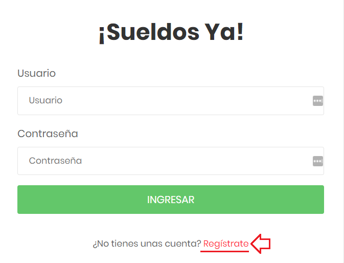
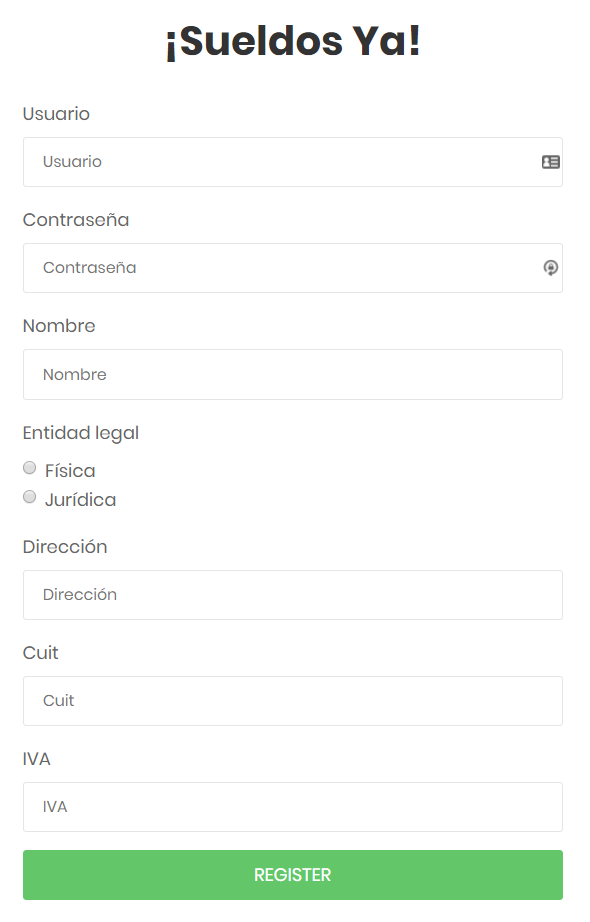

<b>uade integracion de aplicaciones</b>
# Sistema de liquidacion de sueldo

<b>indice</b>
* [ABM de clientes](#abm-clientes)
* [ABM de empleados y asociacion con clientes](#abm-empleados). Los tipos posibles de empleados son:
	* Empleados con sueldo por hora
	* Empleados con sueldo por mes
* [Carga de novedades de empleados](#carga-de-novedades). Las novedades son:
	* Para empleados por hora, se carga novedad de horas trabajadas
	* Para empleados por mes, se carga novedad de vacaciones (se resta de su salario)
* [Liquidacion de sueldo de empleado](#liquidacion-de-sueldo).
	* Para empleados por hora, se multiplica horas trabajadas (cargadas en novedades) por suelo por hora
	* Para empleados por mes, el salario base menos 1/30 de salario por cada dia de vacaciones (cargadas en novedades) 
* [Facturacion de servicios brindados](#facturacion-de-servicios)

---
### ABM clientes
* Crear usuario<br>
<b>recurso /login</b><br>
	desde el frontend seleccionar la opcion registrarse <br>
	<br>
	completar el formulario <br>
	<br>

* Obtener el client id de tu usuario
```
curl -X POST http://localhost:3000/client/auth -H 'Content-Type: application/json' -D '{"username":"lautarin","password":"1337"}'
```

response 
```
{
    "_id": "5bd99cb677a9412434bbd2f1",
    "name": "Lautarin"
}
```

* Get client
```
curl -X GET http://localhost:3000/client/:clientId
```

Response
```
{
    "person_type": [
        "physical"
    ],
    "address": "Casa de Lautarin",
    "cuit": "1233312",
    "iva": 21,
    "gross_income": null,
    "pay_date": null,
    "employees": [
        "5bd99d1377a9412434bbd2f2",
        "5bd99d4977a9412434bbd2f3",
        "5bd9a1dc77a9412434bbd309",
        "5bd9a24b77a9412434bbd30a",
        "5bd9a31377a9412434bbd320",
        "5bd9b85469876372dbcb740a",
        "5bd9b89969876372dbcb742e",
        "5bd9ba5faeabbf7f944946a3"
    ],
    "billings": [
        "5bd9a90b801f8105ee01b0e4",
        "5bd9a917801f8105ee01b0e6",
        "5bd9aa66888ba0068c0c1eca",
        "5bd9aaa1888ba0068c0c1ecc",
        "5bd9aed65d1c733fdb13ce4f",
        "5bd9b08463334009e8b69557"
    ],
    "creation_date": "31/10/2018 09:07:45",
    "status": "active",
    "_id": "5bd99cb677a9412434bbd2f1",
    "username": "lautarin",
    "password": "1337",
    "name": "Lautarin",
    "__v": 0
}
```

* Delete client
```
curl -X DELETE http://localhost:3000/client -H 'Content-Type: application/json' -D '{"id":"5bd99cb677a9412434bbd2f1"}'
```

* Update client

```
curl -X PUT http://localhost:3000/client -H 'Content-Type: application/json' -D '{"name":"nombre","person_type":"physical|legal entity","cuit":123123123,"iva":21,"gross_income":1000,"employees":[]}'
```

---
### ABM empleados
 * Obtener los empleados de un cliente
 
 ```
curl -X GET http://localhost:3000/client/:clientId/employees
```
response
```
[
    {
        "address": "Casa Esclavo1",
        "birth_date": "11 de Noviembre",
        "dni": "38745192",
        "payroll_type": "monthly",
        "gross_salary": 75,
        "salary_per_hour": null,
        "estimated_hours": null,
        "deductions": 17,
        "creation_date": "31/10/2018 09:07:45",
        "status": "inactive",
        "_id": "5bd99d1377a9412434bbd2f2",
        "updates": [],
        "salaries": [],
        "name": "Esclavo1",
        "__v": 0
    },
    {
        "address": "Casa Esclavo2",
        "birth_date": "24 de Abril",
        "dni": "40726522",
        "payroll_type": "per_hour",
        "gross_salary": null,
        "salary_per_hour": 0.2,
        "estimated_hours": 380,
        "deductions": 17,
        "creation_date": "31/10/2018 09:07:45",
        "status": "active",
        "_id": "5bd99d4977a9412434bbd2f3",
        "updates": [
            {
                "update": "worked_hours",
                "mount": 400,
                "creation_date": "31/10/2018 09:07:45",
                "status": "inactive",
                "_id": "5bd99e8877a9412434bbd2f4"
            }
        ],
        "salaries": [
            {
                "gross_income": 80,
                "net_income": 80,
                "pay_date": "31/10/2018",
                "creation_date": "31/10/2018 09:07:45",
                "status": "pending",
                "description": [
                    {
                        "_id": "5bd99f2277a9412434bbd2f7",
                        "description": "400 horas trabajadas.",
                        "mount": 80
                    }
                ],
                "_id": "5bd99f2277a9412434bbd2f6"
            }
	]   
	"name": "Esclavo2"
   }
```

* Crear empleado
```
curl -X POST http://localhost:3000/employee -H 'Content-Type: application/json' -D {BODY}
```

body 
```
{
    "address": "Casa Esclavo1",
    "birth_date": "11 de Noviembre",
    "dni": "38745192",
    "payroll_type": "monthly"|"per hour",
    "gross_salary": 75,
    "salary_per_hour": null,
    "estimated_hours": null,
    "deductions": 17,
    "name": "Esclavo1"
}
```

* Modificar empleado

```
curl -X PUT http://localhost:3000/employee -H 'Content-Type: application/json' -D {BODY}
```

body

```
{
    "address": "Casa Esclavo1",
    "birth_date": "11 de Noviembre",
    "dni": "38745192",
    "payroll_type": "monthly"|"per hour",
    "gross_salary": 75,
    "salary_per_hour": null,
    "estimated_hours": null,
    "deductions": 17,
    "name": "Esclavo1"
}
```

---
### Carga de novedades
* Obtener las novedades de un cliente
```
curl -X GET http://localhost:3000/client/:clientId/updates
```
response
```
[
    {
        "update": {
            "update": "worked_hours",
            "mount": 400,
            "creation_date": "31/10/2018 09:07:45",
            "status": "inactive",
            "_id": "5bd99e8877a9412434bbd2f4"
        },
        "employee_id": "5bd99d4977a9412434bbd2f3",
        "employee_name": "Esclavo2"
    },
    {
        "update": {
            "update": "salary_change",
            "mount": 1000,
            "creation_date": "31/10/2018 09:07:45",
            "status": "inactive",
            "_id": "5bd9a4f777a9412434bbd33d"
        },
        "employee_id": "5bd9a1dc77a9412434bbd309",
        "employee_name": "Esclavo3"
    }
]
```

* Crear una novedad
```
curl -X POST http://localhost:3000/update -H 'Content-Type: application/json' -D '{"update":"salary_change|per_hour_change","mount":"150","employeeId":"5bd9a1dc77a9412434bbd309"}'
```

---
### Liquidacion de sueldo

```
curl -X GET http://localhost:3000/payroll/:clientId
```

---
### Facturacion de servicios

* Obtener las facturas de servicio de un cliente

```
curl -X GET http://localhost:3000/billing/:clientId
```

response 
```
[
    {
        "bill_number": 33,
        "creation_date": "31/10/2018 15:33:25",
        "expiration_date": "01/12/2018 15:31:05",
        "status": "payment pending",
        "_id": "5bd9f575eda39606048a3c63",
        "base_cost": 20000,
        "cost_per_employee": 500,
        "employees_amount": 1,
        "iva_percent": 21,
        "gross_amount": 20500,
        "iva_value": 4305,
        "total_amount": 24805,
        "__v": 0
    },
    {
        "bill_number": 35,
        "creation_date": "31/10/2018 15:37:42",
        "expiration_date": "01/12/2018 15:37:34",
        "status": "payment pending",
        "_id": "5bd9f67653e38b199cfc76f6",
        "base_cost": 20000,
        "cost_per_employee": 500,
        "employees_amount": 1,
        "iva_percent": 21,
        "gross_amount": 20500,
        "iva_value": 4305,
        "total_amount": 24805,
        "__v": 0
    }
]
```

* Generar la facturacion por servicios a un usuario

```
curl -X POST http://localhost:3000/billing/:clientId
```


